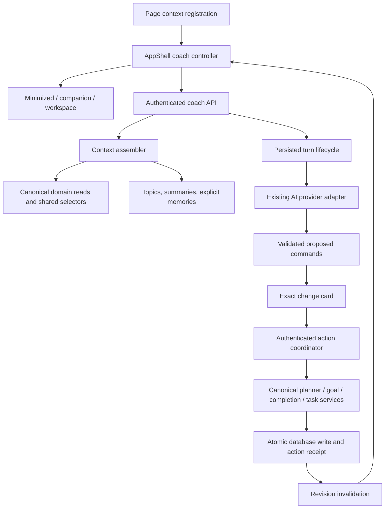

# Central coach: companion, workspace, and system architecture

Status: proposed design for review, not an implementation or production cutover.
Prepared September 27, 2026, from repository commit `6623a91d` and the companion/workspace exploration in this task. No application code, migrations, or production data were changed. No test, typecheck, lint, browser, or CI suites were run.

## 1. Recommended decision

Build one application-wide coach with three presentation states: minimized, companion, and expanded workspace. Its identity, conversations, in-flight response, draft input, topic understanding, and actions survive changes between those states and application pages.

Replace the planner-owned conversation lifecycle. Keep the planner, completion, goal, and check-in domain foundations, improving their boundaries where necessary. The coach becomes another authorized client of those foundations.

Use a modular monolith in the existing Next.js application and Supabase database. Keep the existing AI provider integration initially. This requirement does not justify a separate agent microservice, autonomous multi-agent framework, vector database, or general-purpose workflow engine.

The most important distinction is between **current app facts**, **page context**, **conversation history**, and **remembered understanding**. They have different owners and freshness rules; mixing them into one growing prompt would make the system less reliable over time.

## 2. Product contract

### One coach in three states

- **Minimized:** a persistent entry point across authenticated pages. Preserve the selected topic, conversation, and input draft. Show an unobtrusive check-in invitation when due; do not generate a model response just because the launcher is visible.
- **Companion:** a desktop side pane that leaves the page usable. On narrow screens use a sheet that can expand; retain a clear return path to the underlying page. The prototype stacks surfaces at narrow widths for comparison, rather than implementing the production sheet gesture.
- **Workspace:** a deep-linkable `/coach/:topicId/:threadId` view. It uses the same conversation controller and message renderer. Add the topic navigator and an understanding panel: current intention, supported observations, remembered preferences, linked goals, check-ins, and action history.

Expanding does not create or copy a conversation. Returning restores the source page, selected date, filters, and scroll position where feasible. The expanded view distinguishes “currently in Coach” from “opened from Plan / selected writing session.” A direct visit to a coach URL has no invented source page.

### Topics and conversations

A topic is an ongoing concern such as Writing, Energy, or My week. It can relate to zero or several goals and can outlive individual goals or calendar months. A conversation is a discussion inside a topic. Default to one ongoing conversation per topic; expose “New conversation” for a fresh line of thought without losing the topic’s understanding.

Create a default My week topic once per account, not every week. Support create, rename, archive, restore, and delete. Archive retains history and memories. Delete explains and removes the related conversation-derived understanding; global preferences explicitly retained by the user are handled separately. Do not infer topic boundaries by constantly moving the user between rooms. The coach may suggest a new topic, but the user chooses it.

### Check-ins belong to the coach

Keep the lightweight Open/Skip invitation and Recap/Next structure. Open the check-in within the current coach surface, and let “Talk through this” continue with a typed reference to that check-in. Replay remains available from Settings and the workspace.

Preserve monthly-first, then weekly, then daily cadence; profile week start; calendar-based weekly/monthly windows; and the daily recap since the last presented check-in. Presenting the invitation counts as the day’s presentation. Opening the details triggers briefing generation. Merely viewing a check-in never changes the plan.

Goal creation stays out of daily/weekly check-in suggestions. The user can still explicitly ask the general coach to create a goal at any time. This separates check-in editorial policy from the coach’s capability.

### Proposed behavior changes to approve with implementation

1. The global companion/workspace replaces the planner-specific panel and separate full check-in dialog.
2. Coach proposals do not silently modify a planner draft. The user reviews an exact change and applies it; successful application commits the real domain change.
3. Conversations save automatically and persist across months/devices. There is no “Save this conversation” snapshot workflow.
4. Topics accumulate inspectable understanding with editable memories. Current app statistics are never stored as durable personal memories.

These intentionally supersede the old “coach opens a sheet owned by Plan” and “full check-in is an independent overlay” interaction locks. Other destination, completion, and planner semantics remain owned by their existing domains.

## 3. What the repository actually does today

These are findings from source inspection, not assumptions about deployed data or runtime behavior.

| Area | Current implementation | Consequence |
|---|---|---|
| Application shell | [`app-shell.tsx`](/Users/jerryliu/Documents/Goalmaxxing/src/components/layout/app-shell.tsx) mounts `CheckInOverlay`, but no global coach controller. | There is a natural persistent integration point, but it needs a new coach owner. |
| Coach lifecycle | [`use-calendar-surface-coach-session.ts`](/Users/jerryliu/Documents/Goalmaxxing/src/features/planner/use-calendar-surface-coach-session.ts) wires the coach to calendar draft functions. [`coach-types.ts`](/Users/jerryliu/Documents/Goalmaxxing/src/features/planner/coach/coach-types.ts) takes preview, draft policy, queue-move, and calendar context arguments. | Hoisting this hook wholesale would drag the planner UI into every page. |
| Client persistence | [`coach-session.ts`](/Users/jerryliu/Documents/Goalmaxxing/src/features/planner/coach-session.ts) keeps at most 20 messages for 12 hours in session storage keyed by month and timezone. The key does not include the account ID. | This is a temporary planner session, not durable personal conversation storage. Do not auto-import unidentified browser sessions into a user account. |
| Saved conversations | [`use-coach-conversation-persistence.ts`](/Users/jerryliu/Documents/Goalmaxxing/src/features/planner/coach/use-coach-conversation-persistence.ts) manually saves/restores snapshots and reloads around calendar/month state. Public SQL tables constrain message counts and ordinals to 20. The save RPC inserts a new conversation. | Replace the storage lifecycle and constraints rather than extending snapshot saving indefinitely. |
| Coach request | [`/api/planner/coach/route.ts`](/Users/jerryliu/Documents/Goalmaxxing/src/app/api/planner/coach/route.ts) loads canonical goals/plan server-side, but accepts message history and a deterministic summary from the client. | Keep server canonical loading and sanitization; stop treating client-supplied history or summaries as authoritative. |
| Automatic draft edits | [`use-planner-coach.ts`](/Users/jerryliu/Documents/Goalmaxxing/src/features/planner/coach/use-planner-coach.ts) invokes `applyCoachPatchesToDraft` after a model reply; manual apply can persist default policy. | Separate conversation response, proposal preview, and committed action. Do not transplant the mixed lifecycle. |
| Planner correctness | [`context-loader.ts`](/Users/jerryliu/Documents/Goalmaxxing/src/lib/planner/context-loader.ts), draft commands, kernel, publish payload, and [`/api/planner/save/route.ts`](/Users/jerryliu/Documents/Goalmaxxing/src/app/api/planner/save/route.ts) already encode schedule digests, preview hashes, linked goals, and stale-write behavior. | Reuse and extract the canonical services. The coach must not create an alternate scheduling algorithm or direct table-write path. |
| Completion correctness | [`/api/completions/route.ts`](/Users/jerryliu/Documents/Goalmaxxing/src/app/api/completions/route.ts) uses exact-date dispatch, canonical completion RPCs, and existing XP/feedback behavior. | Coach completion must go through the same service semantics, including cascades and feedback. |
| One-off tasks | [`tasks/[taskId]/schedule/route.ts`](/Users/jerryliu/Documents/Goalmaxxing/src/app/api/planner/tasks/[taskId]/schedule/route.ts) is distinct from goal sessions and currently accepts a target date without an expected version. | Keep task and goal-session identities distinct. Add necessary concurrency protection to the canonical task path before exposing coach apply/undo. |
| Check-in computation | [`src/lib/digest/`](/Users/jerryliu/Documents/Goalmaxxing/src/lib/digest) computes facts, periods, suggestions, persistence, and presentation eligibility. | Reuse this domain. Correct its freshness/pagination limits as part of integration; do not start a second recap calculator. |
| Check-in handoff | [`coach-prompt-seed.ts`](/Users/jerryliu/Documents/Goalmaxxing/src/lib/coach/coach-prompt-seed.ts) uses session storage plus a window event because check-in and coach are on different surfaces. | Retire the handoff after direct global invocation exists. |
| Client invalidation | [`planner-tab-cache.ts`](/Users/jerryliu/Documents/Goalmaxxing/src/lib/cache/planner-tab-cache.ts) already exposes a planner-related invalidation subscription. | Extend this rather than introducing a competing cache event system. Cross-device freshness still needs a server signal. |
| Provider | [`gemini.ts`](/Users/jerryliu/Documents/Goalmaxxing/src/lib/ai/gemini.ts) implements bounded JSON generation, error normalization, retry/fallback, and timeouts. | Reuse its protections; add a narrow streaming capability rather than replacing the AI stack. |

The public conversation schema and current save RPC are in [`20260808012000_additive_public_ai_and_coach.sql`](/Users/jerryliu/Documents/Goalmaxxing/supabase/migrations/20260808012000_additive_public_ai_and_coach.sql) and [`20260808170747_additive_phase16_drop_coach_save_wrapper.sql`](/Users/jerryliu/Documents/Goalmaxxing/supabase/migrations/20260808170747_additive_phase16_drop_coach_save_wrapper.sql). The earlier private-table migration is historical, not the intended migration source.

## 4. System boundaries



### Frontend ownership

Add `src/features/coach/` with a thin provider/controller, context registration hook, conversation transport, surface composition, and presentation components. Reuse the current message and goal-draft primitives after extracting their dependencies. Keep planner algorithms out of this directory.

Mount the stable coach provider in the authenticated layout’s shell, outside page transition/remount boundaries. Do not put it inside `DuoProvider`’s changing key. Feed authorized Duo context through a child bridge without resetting coach state. Scope the controller by authenticated user, and clear state on sign-out/account change.

The provider owns only presentation mode, selected topic/thread, drafts, active transport subscriptions, and page context. Persisted messages, run state, actions, and memories belong to the server. Use the existing cache conventions and a focused reducer/hooks; do not add a global state library or broad cache migration just for this feature.

Full workspace routes select the same provider state; they do not mount another coach session. Direct route loads hydrate from the server. Keep one active transcript/composer mounted per surface at a time so controls, focus, and screen-reader announcements are not duplicated.

### Backend ownership

Add `src/lib/coach/` modules for contracts, context assembly, conversation repository, turn orchestration, capability dispatch, actions, and memory. Keep the actual planner/goal/completion implementations in their canonical domain directories.

Routes handle authentication, strict schema parsing, bounded request sizes, rate limits, and typed errors. Services orchestrate. SQL owns transactional invariants. Use existing `src/lib/api/route.ts`, `src/lib/env.ts`, feature flags, and `reportError`; extract shared logic from route files rather than making internal HTTP calls between routes.

## 5. The “always current” contract

The enforceable promise is: **every answer and every action uses an authoritative, versioned snapshot; the UI actively refreshes after changes and openly distinguishes an old snapshot from current data.** An offline device cannot know an unseen server write, and a model already generating a response does not update itself magically.

### Context envelope

```ts
type CoachContextEnvelope = {
  schemaVersion: 1;
  asOf: string;
  localDate: string;
  timezone: string;
  week: { start: string; end: string; weekStartsOn: number };
  freshness: { revision: string; state: "fresh" | "refreshing" | "stale" };
  page: {
    surface: "plan" | "checklist" | "progress" | "community" | "you" | "coach";
    view?: "day" | "week" | "month";
    selectedDate?: string;
    selectedGoalId?: string;
    selectedItemId?: string;
    scope: "self" | "duo";
    sourcePage?: ValidatedSourcePage;
  };
  today: TodayFacts;
  thisWeek: WeekFacts;
  activeGoals: GoalOverview[];
  checkIn: CheckInReference | null;
  topic: TopicContext;
  relevantMemories: MemoryWithSource[];
  recentMessages: PersistedMessage[];
  permissions: AvailableCoachCapabilities;
};
```

This is a conceptual contract, not a copy-ready implementation. All referenced types need strict boundary schemas and bounded sizes.

Always include a compact today/this-week baseline, even when looking at a historical month. Selected date is not “today.” Resolve local date, timezone, and week start on the server using the canonical profile/preferences helpers. If timezone is unconfirmed, allow general conversation but require confirmation before date-dependent actions.

The client submits page identifiers and selection IDs. A server-owned surface registry supplies each page’s purpose and supported operations. Validate IDs, ownership, scope, and date ranges. Never accept a client string saying “this page allows deleting all goals” as authority. Never scrape the page DOM into a system prompt. Clear transient selection on navigation/unmount; the last page to register cannot win an asynchronous race against a newer navigation.

Scope data conservatively: self is the default; a Duo/community view can add only data the current user is explicitly authorized to read. Being able to view a partner’s progress does not authorize mutating their goals or ingesting their private coach history. Do not store other people’s private information as personal coach memory.

### Canonical facts

Compose reads over existing planner snapshots, task reads, goal progress, completions, and digest projections. Move the useful deterministic coach summary formatter out of the browser-owned feature layer and feed it server-validated input. Inspect whether planner snapshot loading performs preparation/reconciliation before reusing it for every lightweight request; extract a read-only fact projection where needed.

Keep metric definitions explicit. “Completed scheduled sessions,” “all completions,” “remaining requirements,” and “unplaced work” are different quantities. Reuse each domain’s canonical derivation. Do not collapse off-plan completions or linked-goal credits into the digest’s scheduled-session numerator. Do not treat estimated minutes as measured effort.

`loadDigestSnapshot` currently limits individual result sets to 500 rows. Replace silent truncation with pagination/aggregates or an explicit incomplete-data error before using those reads as comprehensive coach facts. This is particularly relevant to monthly recaps and long gaps between daily check-ins.

### Freshness lifecycle

1. On coach open, page/selection change, app focus/reconnect, and local-day rollover, refresh relevant context.
2. After a successful local domain mutation, reuse the existing planner cache invalidation subscription to refresh app and coach facts. Update visible optimistic state as pending; do not claim the server has confirmed it yet.
3. Add one owner-scoped `coach_context_versions` row. Relevant canonical writes bump it transactionally through focused triggers/domain write functions: goals, links, completions, planner assignments/preferences, one-off tasks, and profile calendar settings. Use it only as a freshness signal, not a duplicate business invariant.
4. Subscribe to that small RLS-protected row for cross-device invalidation. Coalesce changes. Realtime is a latency improvement, not the correctness boundary: re-fetch on reconnect and before all turns/actions even if no event arrived. If disconnected while visible, use a bounded revision poll; pause it while hidden. Do not poll an LLM.
5. Before generating an answer, read the authoritative context on the server. For multi-query reads, verify revision before and after assembly; retry once when they differ, then return `context_refresh_required` rather than using a mixed snapshot. This requires every contributing canonical write to participate in the revision scheme and reads to use a consistent authoritative database endpoint.
6. Record the snapshot revision and page selection on the run. If relevant facts change while generating, mark the response’s source time and refresh the current-facts strip. Do not present old statistics as newly verified; regenerate once where the answer materially depends on the changed data, otherwise keep it labeled as an earlier snapshot. Proposed actions remain unusable until their own preconditions pass.
7. On Apply, atomically check the domain preconditions under the canonical write boundary. Client context freshness cannot authorize a stale write.

Reuse existing planner schedule digests/revisions as action preconditions. The new broad invalidation version does not replace them and should not make every unrelated profile edit invalidate a writing move.

Suggested service targets, to validate later: local UI invalidation immediately after commit; cross-device context convergence within a few seconds when connected; context-read p95 under 500 ms under realistic account size; visible acceptance/progress within 300 ms excluding cold-start/network variation. These are targets, not measurements.

Supabase supports subscribing to Postgres changes with row access governed by RLS; the implementation should restrict subscriptions to each owner’s version row. [Supabase Postgres Changes documentation](https://supabase.com/docs/guides/realtime/postgres-changes)

## 6. Persistence and understanding over time

### Proposed tables

| Table | Purpose and important fields |
|---|---|
| `coach_topics` | Owner, title, archive state, intention, bounded summary, summary source references, summary version and covered message position. Unique default-topic marker per owner. |
| `coach_topic_goals` | Topic-to-goal links. Composite ownership checks prevent linking another user’s private goal. No fabricated copy of goal progress. |
| `coach_threads` | Topic, owner, title, archive state, next message sequence, current version, optional legacy conversation ID for migration. |
| `coach_messages` | Immutable message ID, thread, owner, sequence, role, typed content blocks, optional run ID, source context metadata, client message ID. Unique thread/sequence and owner/client-message-ID. |
| `coach_runs` | Thread, owner, request ID, payload digest, state, context revision, bounded context manifest, provider/prompt version, accepted user-message ID, result IDs, failure code, deadline/lease. |
| `coach_actions` | Owner, originating run/thread, type, validated command, command digest, preview, domain preconditions, lifecycle, result receipt, inverse metadata where supported, optional original-action ID for undo. |
| `coach_memories` | Owner, optional topic, user-stated preference or tentative observation, source message IDs, validity, edited/confirmed state, revision. |
| `coach_context_versions` | One owner row with a monotonic version and updated time, used for invalidation. |

Keep existing `user_digests` as the canonical check-in store. Reference a digest from a typed message block; do not copy it into a second independently editable briefing table. Add the minimal snapshot/presentation metadata needed below.

Persist all accepted conversation history, with pagination. The model sees a bounded window, not the entire history. Database limits protect individual message/block sizes and account storage, rather than capping a lifetime conversation at 20 messages.

Use composite foreign keys/ownership constraints where child records duplicate `owner_id`. RLS must cover owner reads and authorized mutations; action commands, receipts, and assistant messages are server-authored. Use hardened SQL functions (`search_path=''`, explicit ownership checks, least grants) where privileged coordination is necessary. Topic/thread renames use version checks; immutable messages use append-only sequences allocated under a row lock.

### Three kinds of understanding

1. **Live facts:** current goals, schedule, completions, and profile settings. Re-read from canonical storage. Never turn “3 sessions left” into personal memory.
2. **User-stated preferences:** “Remember that I prefer mornings.” Save with scope and provenance; show a small saved-memory notice with edit/forget controls. A preference informs proposals but does not silently mutate planner policy.
3. **Inferred observations:** “Writing often slips on weekdays.” Keep tentative, source-backed, and dated. Compute numerical patterns deterministically when possible. Do not promote an inference into a global fact or a user commitment.

Topic summaries condense goals, decisions, and unresolved questions with source pointers. Update them from a known message range and compare-and-swap against that range so a late summary cannot overwrite newer understanding. If summarization fails, the conversation still works using the last valid summary plus the uncovered recent messages.

Retrieve active-topic summary, explicitly global preferences, linked-goal facts, and a bounded set of relevant cross-topic references. Start with relational queries and optional Postgres full-text search; add embeddings only when a measured retrieval problem justifies them. Do not dump every topic into every prompt.

Editing/deleting a memory must invalidate its derived summary and future prompt material. Deleting source conversations must remove or recompute source-dependent understanding; do not silently recreate a forgotten memory from an old cached summary. Retain a suppression record for an explicitly forgotten preference while its source remains, or exclude that source from re-extraction. Account deletion cascades through this data. Operational logs should not contain raw transcript content by default.

## 7. Turn orchestration and transport

### Request contract

`POST /api/coach/threads/:id/turns` accepts a client request ID, new user text, an expected conversation version, and a typed page/selection context. It does not accept an authoritative assistant transcript, user ID, or fabricated summary.

The server:

1. Authenticates and authorizes the thread, bounds the request, and reserves the request ID.
2. Atomically appends the user message and creates the run. A retry with the same request ID and payload returns the existing run; the same ID with different content returns an idempotency conflict. Quota reservation is associated with the run so a network retry is not charged as a new turn.
3. Loads fresh context and bounded history, then calls the existing provider adapter.
4. Allows a small, explicit set of authorized read operations for deeper context. Bound the number of read rounds and token budget; avoid an unbounded agent loop.
5. Validates the full reply/proposals. Persist final message blocks and server-sealed proposed actions before announcing completion.

Use a typed event stream (`accepted`, `context_ready`, `reading`, `text_delta`, `proposal_ready`, `completed`, `failed`) for presentation. Partial JSON/tool arguments are never executable. If the existing configured model cannot safely provide incremental structured text, stream real status stages and then the validated response; do not manufacture typing animation from a completed answer.

The current adapter uses non-streaming `generateContent`. Add streaming behind the same narrow provider boundary with the same deadlines, size limits, cancellation, error normalization, and schema validation. Provider capability must be checked against the configured model during implementation. Schema-conforming output still requires business validation. [Gemini structured-output documentation](https://ai.google.dev/gemini-api/docs/structured-output)

### Concurrency and failure behavior

- One generating run per thread initially, enforced by a database constraint. Other topics/threads can run independently within account limits. Keep the unsent draft when a run is busy.
- Navigation and surface changes leave the transport owned by the persistent provider, so a page unmount does not cancel generation.
- Persist run identity and final state. Reconnect reads `/api/coach/runs/:id`; it must not silently issue a second model request. Partial token replay is not required initially; recover the persisted final result or show the known in-progress/failed state.
- A timeout or disconnect that ends request-bound execution produces a retryable run state. Use a bounded run deadline/lease and terminal-state compare-and-swap so a late response cannot commit after cancellation or a newer attempt.
- Failed user messages remain visible with Retry. Retrying generation reuses the accepted user message, creates an explicit new attempt, and does not duplicate it. No proposal may execute unless it reached the persisted ready state.
- Cancellation of generation cannot undo a committed domain action. Action receipts are reconciled independently.

Do not claim that generation continues reliably after closing the browser. That requires a durable worker/queue deployment with retries and leases, which is outside the current ask. The run model leaves a clean path to that later without requiring it for an always-available contextual companion.

## 8. Actions: real changes, one canonical path

### Initial capability set

| Capability | Read/preview behavior | Commit path |
|---|---|---|
| Explain today/week/goal progress | Shared canonical facts and structured references | None |
| Move a goal session / adjust a bounded plan | Compile existing draft commands and policy patches; run canonical preview | Extract existing planner save/publish service and its protected SQL boundary |
| Record or remove a completion | Resolve goal/session/date identity and exact expectation | Existing exact-date completion service and canonical RPCs; preserve cascades/XP |
| Move or complete a one-off task | Use task identity, not a goal-session ID | Existing task domain RPCs after adding shared stale-write/idempotency guarantees |
| Create goals from a request | Reuse goal-draft parsing, forms, schemas, and relationship validation | Canonical goal creation service; make required goal/link writes atomic before exposing as one coach action |
| Change an explicit planner preference | Show exact preference and any schedule impact separately | Existing preference validation and canonical write service |

Changing a scheduling preference and moving an existing session are separate intents. A one-off move must not silently rewrite defaults. Do not expose unsupported destructive or social mutations as apparent capabilities.

### Action lifecycle

`proposed → applied | rejected | superseded | expired`; errors retain a typed failure and whether retry is possible. Undo is a separate linked action/receipt, not deletion of the original action record.

The server stores the exact validated command, canonical preview, expected target versions/digests, and command hash. Apply requests carry an action ID and idempotency key, not a client-edited command body. The displayed card and executable command must refer to the same sealed version. Edits or refreshed previews create a superseding action requiring a new Apply.

For a schedule change, the expected state includes the existing schedule digest and preview/confirmation hashes required by planner publish, not just a session date. Recompute and compare necessary domain state before commit. If it differs, return `action_stale` and a path to refresh; do not silently rebase and apply a different change.

For completion/task operations, use the narrowest existing valid identity and preconditions. A move should not fail merely because an unrelated memory was edited. Add missing checks to the canonical operation used by normal UI callers as well as coach callers.

### Transaction boundary

The authorized SQL coordinator locks the action, checks owner and command hash/preconditions, invokes the existing canonical domain write, and records the receipt in the **same database transaction**. A crash cannot leave “domain write succeeded but receipt missing” as an ambiguous second-write invitation.

Keep canonical SQL logic in its existing functions. A thin action transaction coordinator composes those functions; it must not reimplement scheduling or completion rules. Allow execution only of server-sealed commands. If the coordinator is callable with an authenticated JWT, it must independently verify `auth.uid()` and all authorization/preconditions; relying on the API route alone is insufficient. The client cannot write command/receipt rows.

Return the same receipt on repeated Apply, including after a lost response. Reject an idempotency key reused for a different action. Use existing XP/outbox mechanisms for post-commit feedback; a failed toast/cache refresh does not make a committed completion fail or repeat its reward.

Do not present a mixed goal-create/link/plan rewrite as atomic until it can commit in one database transaction. Initial multi-step proposals may instead expose clearly separate reviewed actions with individual receipts.

### Undo and draft interactions

Undo applies a compensating command with a precondition on the post-action state. If someone edited the same target afterward, offer a fresh proposal rather than restoring a whole old policy/schedule over newer work. Only label actions undoable when a safe inverse is supported; goal creation can link to the normal edit/archive surface instead.

Unsaved planner edits require an explicit ownership rule. Recommended initial behavior: if the current page has an unsaved planner draft, show “Save or discard the draft before applying this change.” Do not overwrite or implicitly publish it. A stale draft on another device must fail its existing digest check after a coach commit. A future shared persistent draft is a separate feature, not a prerequisite for the global coach.

## 9. Check-in integration details

Keep `user_digests` and `/api/digest/*`. Extract the current Recap and action-list presentation into reusable body components rendered inside coach. Replace the overlay owner with a small AppShell invitation controller that calls `openCoach({ checkInId })`.

A check-in reference has identity, kind, recap/ahead windows, `factsDigest`, generated-at time, and presentation state. On open, bind the briefing to the exact facts it used. The existing service can return fresh facts with previously stored suggestions; fix that mismatch by attaching suggestions to their facts digest. If facts materially changed, regenerate on deliberate open/refresh or show the historical text as historical alongside fresh computed rows. Never make an old paragraph look freshly computed.

Presentation and generation have distinct identities. Acknowledge the exact offered check-in and presentation date, rather than recomputing “current” after a midnight/timezone boundary. Enforce dedupe transactionally for the owner/local presentation day. A retrying client or second device cannot create another owed invitation for the same day.

Retain the historical recap as a source snapshot; live completion controls resolve against canonical current state and refresh the computed rows. The coach receives both the historical reference and current facts when discussing it, so “last week then” and “this week now” remain distinguishable.

Generate at most one briefing for the same owner/period/facts digest concurrently; reuse the persisted result. A failed model call must not prevent deterministic recap rows from rendering. Ordinary page changes or completion events refresh facts without triggering new AI briefings or messages.

## 10. API and module shape

Suggested endpoints:

- `GET /api/coach/bootstrap` — topic/thread summaries, presentation preference, current lightweight context and check-in eligibility.
- `GET /api/coach/context` — validated page/selection input and authoritative context summary; private, no-store.
- `POST /api/coach/topics`, `PATCH/DELETE /api/coach/topics/:id` — topic lifecycle; archive is a versioned patch.
- `POST /api/coach/topics/:id/threads`, `PATCH/DELETE /api/coach/threads/:id` — conversation lifecycle.
- `GET /api/coach/threads/:id/messages?before=...` — stable cursor pagination; no client transcript replacement.
- `POST /api/coach/threads/:id/turns`, `GET /api/coach/runs/:id`, `POST /api/coach/runs/:id/cancel` — generation lifecycle and recovery.
- `POST /api/coach/actions/:id/apply`, `/reject`, `/refresh`, `/undo` — typed action transitions; a refresh/undo returns a new linked action when review is required.
- `GET/POST /api/coach/memories`, `PATCH/DELETE /api/coach/memories/:id` — inspectable memory lifecycle with provenance and versions.
- Existing digest endpoints remain the single digest API, with exact-reference acknowledgement added.

Errors include `thread_busy`, `conversation_conflict`, `context_refresh_required`, `capability_unavailable`, `timezone_confirmation_required`, `action_stale`, `draft_resolution_required`, `quota_exceeded`, `run_expired`, and `idempotency_conflict`, plus a correlation ID. Map planner errors into these actionable boundaries without hiding useful domain details behind generic 500s.

Suggested files, all proposed rather than already present:

```text
src/features/coach/
  coach-provider.tsx              # stable controller, identity-scoped
  use-coach-page-context.ts       # transient validated page selections
  use-coach-conversation.ts       # transport + persisted message state
  coach-companion.tsx
  coach-workspace.tsx
  coach-message-list.tsx
  coach-action-card.tsx
  coach-understanding.tsx
src/lib/coach/
  contracts.ts
  context.ts
  surface-registry.ts
  conversations.ts
  turns.ts
  capabilities.ts                # finite typed dispatch, no plugin framework
  actions.ts
  memory.ts
src/lib/planner/                  # existing home for planning rules
src/lib/goals/                    # existing home for goal/completion rules
src/lib/digest/                   # retained check-in domain
```

Extract common domain services only where both existing routes/UI and coach will call them. Avoid one large `coach-service.ts` containing prompting, persistence, planning, and UI state.

## 11. Security, cost, and operational limits

- All reads/actions authorize the authenticated owner; a selected page or model output cannot grant access. Recheck access when applying a previously proposed action.
- Treat stored messages, goal descriptions, and memory text as data rather than instructions that can change tools or permissions. The model receives only an allowlisted set of capabilities. Do not permit arbitrary SQL, filesystem access, or external messaging from this coach.
- Start with bounded context: today/week baseline, active-topic summary, explicit preferences, recent message window, and a few relevant references. Paginate tool reads; bound response size and read rounds. Preserve existing environment-driven quotas and align SQL limits.
- Reserve quota per unique run and explicitly meter retries/new attempts, check-in generation, and memory extraction. Keep those call categories observable; no invisible unlimited background summarization.
- Record run duration, context-read duration, provider latency, input/output size, stale-action count, retry count, action success, and reconciliation failures. Do not log raw private conversations or provider candidate text in production diagnostics by default.
- Context failure leaves conversation history readable. A provider failure leaves deterministic check-ins and normal app workflows usable. An action timeout leads to receipt lookup before retry, not an optimistic success or duplicate mutation.
- Reuse existing auth/session, environment validation, correlation IDs, Sentry, and quota storage. Remove old feature keys only after usage data and limits have been migrated or deliberately retained under the new label.

## 12. Cutover and deletion plan

### Reuse

Canonical planner snapshots, preview/kernel, command schemas, publish guards, exact-date completions, goal parsing/forms/validation, domain RPCs, digest periods/facts, API wrappers, cache invalidation, provider error handling, quotas, observability, existing visual primitives, and targeted domain tests.

### Refactor before reuse

- Extract planner preview/commit orchestration from route/UI ownership into domain services. Both existing UI and coach consume those services.
- Separate goal draft rendering/validation from the coach hook. Verify and close atomicity gaps in bulk goal/link creation before claiming a single action succeeded.
- Move deterministic coach fact formatting to a server-consumable canonical module.
- Add task-version and idempotency protection to the existing task mutation contract and every supported client.
- Split `CheckInOverlay` into invitation ownership and reusable check-in content, preserving cadence and completion behavior.
- Extend digest reads for comprehensive data and suggestion/fact version alignment.

### Replace and then delete

- Calendar-owned `usePlannerCoach` orchestration and `useCalendarSurfaceCoachSession` bindings after all entry points use global coach.
- Month/timezone session-storage conversation source of truth, manual save/restore controls, and the 20-message lifetime storage model.
- Client-authoritative deterministic summary and submitted assistant transcript.
- Planner-specific coach HTTP endpoints once all supported web/mobile callers have moved.
- Prompt-seed session storage/window events and check-in-to-planner navigation handoff.
- Automatic draft application and duplicate coach/check-in hosts.
- Temporary cutover flag and legacy schema/RPC surfaces after migration and rollout are complete.

### Historical data

Backfill each persisted public legacy conversation into a new thread with a stable `legacy_conversation_id` uniqueness constraint. Preserve message order, title, timezone, and month as historical metadata. Group them under an Imported planner conversations topic or a user-selected topic; do not force the new model to remain month-scoped.

Import old proposal metadata only as non-executable historical content. Never replay it. Unsaved browser sessions have no reliable account identity in their storage key, so do not silently associate them with the signed-in user. If retaining them is important, offer an explicit local transcript import with preview; otherwise communicate that only previously saved conversations migrate.

Perform an idempotent initial backfill, disable legacy writes at cutover, then run a final delta backfill. Use a bounded feature flag to choose one writer per account during rollout; do not dual-write both conversation systems. New conversations must not be sent back to the legacy path if a flag is toggled. On a serious issue, disable new writes while retaining readable new history and ship a forward fix.

The repository contains native mobile coach callers. Include shared contracts and supported mobile clients in the cutover audit. If an already distributed mobile build still depends on a retiring route, plan a coordinated minimum-version release or an explicitly time-bounded compatibility decision before deletion. Do not quietly break active clients or create a permanent shim by default.

Use forward-only migrations. Retain legacy data until backfill reconciliation and release acceptance, then remove obsolete tables/functions in a later cleanup migration. Emergency schema/data recovery is backup/PITR, not a down migration that discards new conversations.

## 13. Implementation stack

All steps are proposed. Implement in an isolated worktree when implementation is requested. Create one scoped PR per segment and apply follow-up fixes to the relevant branch.

| PR | Deliverable | Completion condition |
|---|---|---|
| 1. Canonical boundaries | Extract planner/goal/completion services needed by coach; shared fact definitions; task concurrency contract; coverage as code. | Existing UI calls the same domain functions the new coach will use. No new mutation path bypasses canonical rules. |
| 2. Durable conversations | Topic/thread/message/run/action/memory schemas, RLS, strict contracts, repositories, ownership/idempotency invariants, import migration. | Persisted conversations append across months and retry safely; legacy proposals cannot execute. |
| 3. Fresh context | Context assembler, page registry, today/week calculations, revision invalidation, cache integration, cross-device signals. | Every new turn reads server-authoritative context; page/month selection cannot redefine today or ownership. |
| 4. Global conversation experience | AppShell controller, minimized/docked/expanded views, workspace URLs, shared renderer, streaming/status transport, run recovery. | Topic, messages, draft, and in-flight run survive navigation/expansion; sign-out clears state. |
| 5. Real actions | Finite capability set, canonical preview, transaction-bound receipts, stale detection, explicit apply and safe inverse handling. | Apply commits once, updates all relevant surfaces, and never overwrites a newer change. |
| 6. Understanding and check-ins | Summary/memory lifecycle, source visibility, edit/forget, digest integration/versioning and presentation dedupe. | Check-ins and conversation share the same facts and action path; old memories cannot override current app data. |
| 7. Cutover and cleanup | Supported-client migration, final transcript backfill, old entry point/API removal, rollout documentation. | Exactly one conversation writer and coach host; no stale callers or duplicate prompts. |

Feature flag the new experience default-off until the stack works end to end. Implement coverage as code throughout. After the stack exists, self-review for critical/merge-blocking issues and push it. Run only user-approved targeted verification after the repository’s verification gate is satisfied; do not run suites during implementation.

## 14. Acceptance scenarios and test coverage to write

1. Start a message on Plan, expand, select Progress, minimize/reopen: thread and draft are unchanged; page context and purpose are correct.
2. Complete Reading in Checklist: app/coach counters agree. The next answer uses the committed completion, even if its invalidation event was lost.
3. Change the plan on another device: the companion refreshes; an old proposal cannot execute against the new schedule. Reconnect catches a missed event.
4. View December while today is September: “today” and “this week” remain current; December is clearly selected view context.
5. Cross local midnight/week/month boundaries and DST: canonical timezone/week start drive correct facts and cadence, with a single due invitation.
6. Apply twice, lose the HTTP response, retry: one domain change and one authoritative receipt. Feedback does not double-credit XP.
7. Apply then manually edit the same item: Undo cannot overwrite the manual edit. Editing unrelated memory does not invalidate a narrow action unnecessarily.
8. Have an unsaved planner draft: coach explains the conflict and does not silently publish/discard it. A stale draft on another device fails publish safely.
9. Goal completion cascades and off-plan completion metrics match the existing canonical app behavior. One-off tasks never masquerade as goal sessions.
10. Open a check-in on any page, discuss it, and make a change: no planner navigation handoff; historical recap and fresh data remain distinct.
11. Trigger two check-in opens concurrently: one presentation and one generation for the same fact version. AI outage still shows computed rows.
12. Create two topics and several conversations: summaries, explicit global memories, and topic-scoped preferences are used deliberately; unrelated private history is not indiscriminately inserted.
13. Edit/forget a preference and delete its source conversation: subsequent prompts and derived summaries no longer revive it.
14. Concurrent sends to one thread, duplicate request IDs, cancellation, expired run, late provider reply, and reconnect all produce a single coherent transcript.
15. Import legacy history twice: no duplicate threads/messages; old proposals remain historical; account switching cannot import someone else’s browser session.
16. Unauthorized topic IDs, foreign goal references, partner mutations, forged tool arguments, and direct calls to action RPCs are rejected at the actual ownership/write boundaries.
17. Responsive/focus behavior: desktop pane is nonmodal, mobile sheet manages focus, expand/return restores focus, Escape behaves predictably, and streamed updates do not overwhelm a screen reader.

Write domain and service unit coverage, route contract tests, SQL ownership/concurrency/idempotency tests, focused component tests, and a small end-to-end journey set. Reuse and relocate existing relevant tests; remove tests for deleted APIs at cutover.

## 15. Scope deliberately deferred

Autonomous scheduled background work, arbitrary integrations, voice, user-defined tools, generated executable mini-apps, a vector memory store, simultaneous writers in one conversation, and cross-user coaching are separate product expansions. This architecture keeps a path to them without making them dependencies of a reliable central coach.

The long-term foundation is durable identity, fresh canonical reads, explicit memory provenance, and atomic domain actions. Those are the parts worth making rigorous before adding more capabilities.
